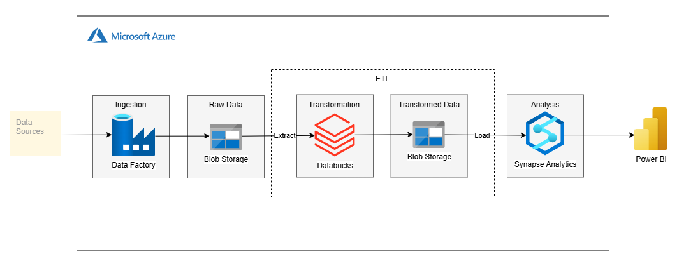

# Tokyo Olympics 2020 Data Pipeline on Microsoft Azure

## Architecture

## Data Source

https://www.kaggle.com/datasets/arjunprasadsarkhel/2021-olympics-in-tokyo

## Tech Stack

1. Python
2. Microsoft Azure
   - Azure Databricks
   - Azure Data Factory
   - Azure Data Lake
   - Azure Synapse Analytics
3. Microsoft Power BI
